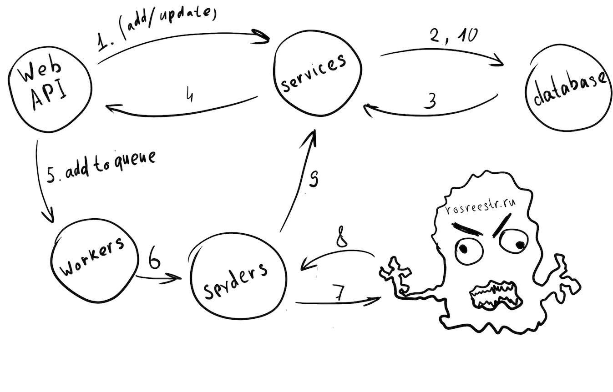

# API для заказа выписок на rosreest.ru

Заказ производится продолжительное время, поэтому внешний номер выписки присваивается не сразу.

## Принцип работы

Основные компоненты:
* app/api.py - API сервис
* app/services.py - бизнесс логика
* python rq worker (не представлен файлом, запускается как сервис)
* app/spyders.py - "пауки" для взаимодействия с сайтом Росреестра

1. Клиент запрашивает заказ выписки через веб (api.py), api.py используя services.py сохраняет запись и добавляет в очередь на выполнение.
2. rq worker берет задачу из очереди и выполняет
3. Функция выполнения задачи (выполняется rq worker'ом) записывает все изменения используя services.py




## Установка

```
alembic upgrade head
```

```
python manage.py deploy
```


## Проблемы

На стороне spyders.py:
* [ ] Периодически зависает после ввода капчи и не совершает действий


Все приложение:
* [ ] При возникновении ошибки в сообщение ошибки не записывается в соответствующее поле (потому что его нет)
* [ ] Статус error поля state надо разделить на adding_error и updating_error
